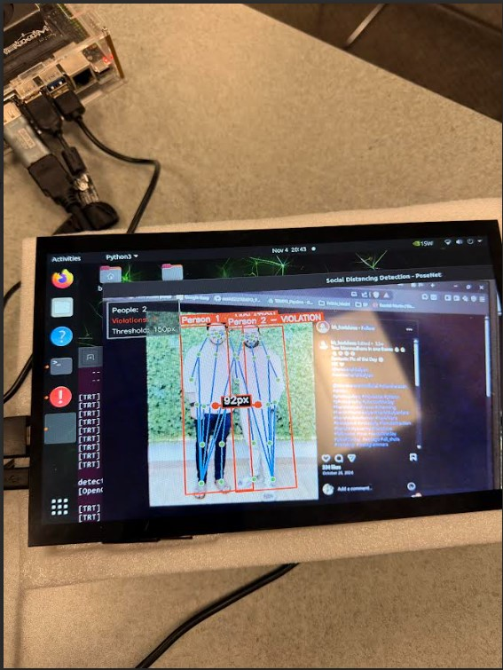

# Anomaly Detection using DetectNet, Jetson-Nano, and USB Camera

## Overview
This project makes use of the posenet model and deploys it on a jetson-nano device to detect whether people have violated social distancing measures. It uses left and right hip keypoints and calculates a mid keypoint and calculates the distance between midpoints of multiple people. if the distance is less than defined threshold, we say they violated social distancing measures.

This project makes use of pretrained models along with OpenCV for frame manipulation.

## Features
- **Real-time Person Detection**: Uses SSD-MobileNet-v2 model for efficient person detection
- **Live Statistics Panel**: The system also keeps a nice anomaly stats box inside the video feed to help user keep track of social distancing violations
- **Visual Alerts**: Bounding boxes change color (green → red) when anomaly threshold is reached

## How It Works
1. The system continuously monitors the video feed
2. When a person is detected, it calculates midpoint of left and right hips
3. If more than 2 people are detected, calculate distance between midpoints of detected people and if distance is less than threshold, violation is triggered.
4. The violation count is displayed in a statistics panel

## Screenshots




## Usage

### Setup
You need to clone the jetson-inference repo first:
```bash
git clone https://github.com/dusty-nv/jetson-inference.git
```

You can create a docker container with the command inside this repo as:
```bash
cd jetson-inference
docker/run.sh
```
This will create a docker container and inside of the container you can clone this repo and run the code and you won't have to install any dependencies.

### Running the Detection Script
```bash
python3 detectnet.py <input_source> <output_destination>
```

**Example:**
```bash
python3 inference.py /dev/video0
```
where `video0` is for the USB camera

## Technologies Used
- NVIDIA Jetson Nano
- JetPack SDK (jetson-inference, jetson-utils)
- OpenCV
- DetectNet (SSD-MobileNet-v2)
- Python 3

