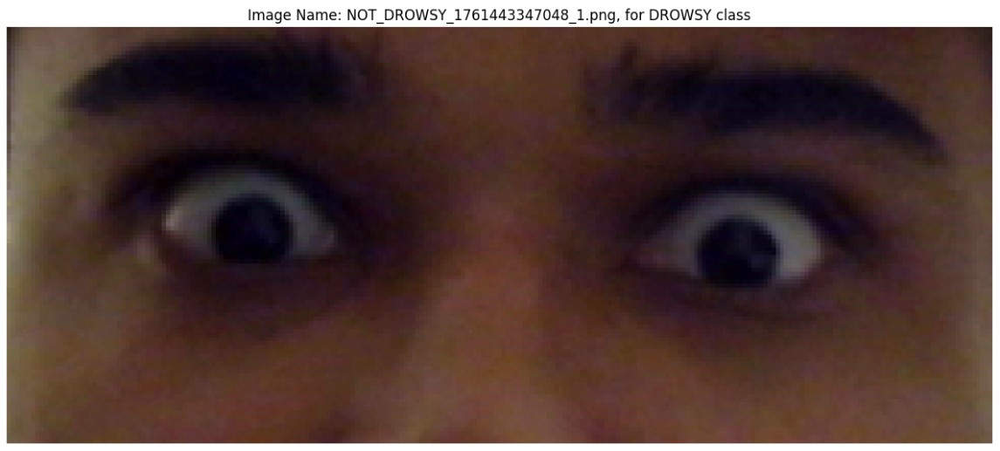
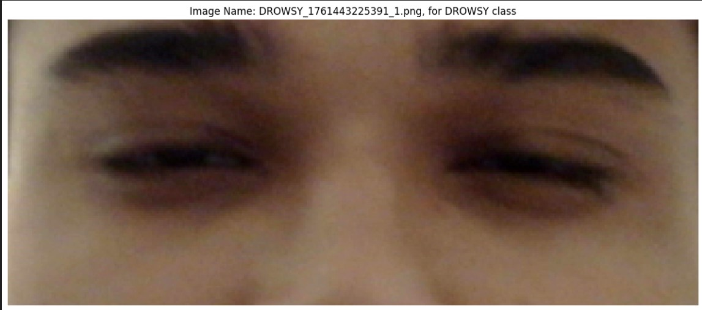
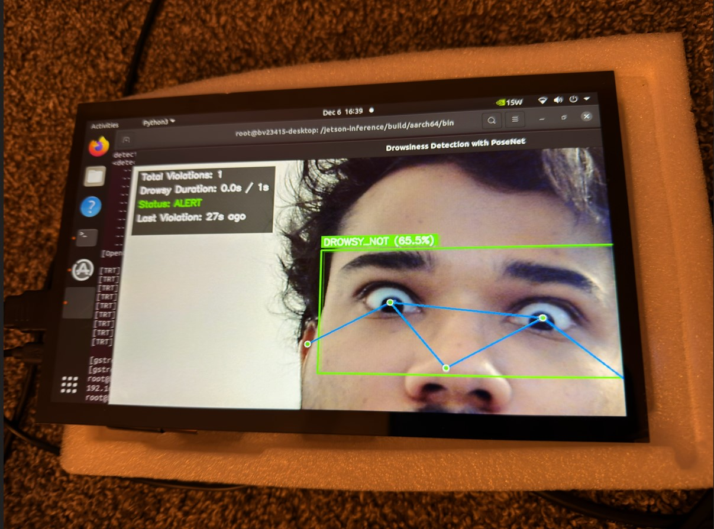
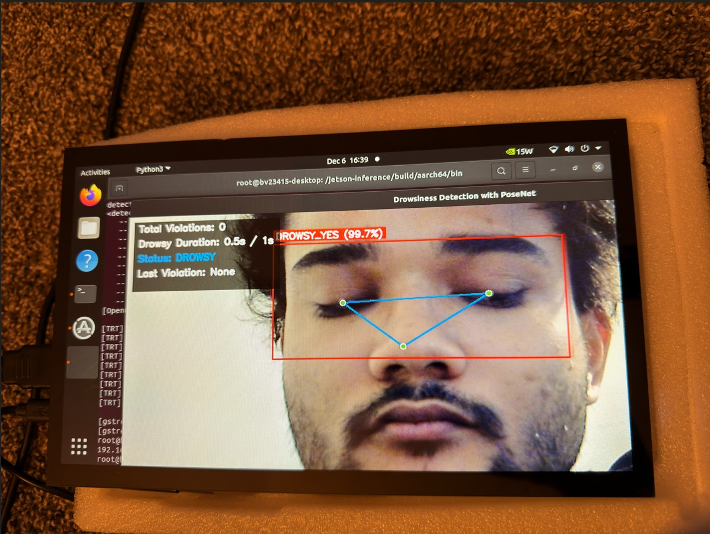
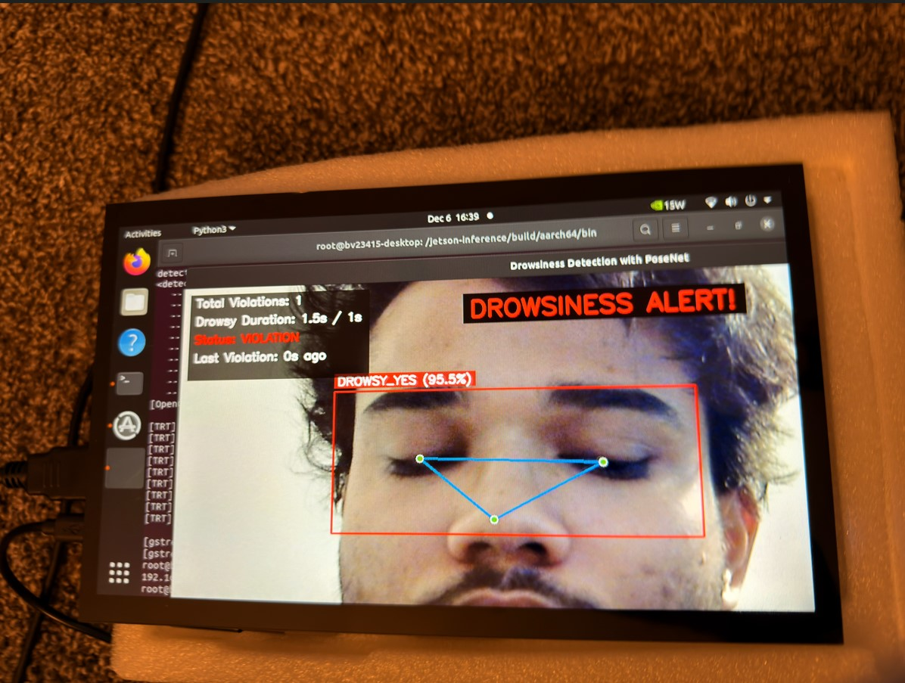

# Drowsiness Detection System

Real-time driver drowsiness monitoring using PoseNet for face tracking and MobileNetV3 for eye state classification on Jetson Nano.

## How It Works

The system tracks a person's face using PoseNet to locate eye regions.
If both (left and right) eyes are detected, we pad the image to get a bounding box that contains both eyes. We then pas this new image of size 3 * 224 * 224 (padded with zero pixels for the finetuned model) and pass it to MobileNetMini-v3 to get binary predictions on whether the case is drowsy or not. 

The MobileNet-v3 model pretrained on imagenet (which has 1000 classes) is used with its final layer replaced with a linear layer with 3 neurons which just outputs two logits, passed through softmax to get predicted probabilities of both classes. This model's earlier layers are frozen (weights aren't changed during training) and only the final layer is updated (extracting embeddings + performing classificaiton on those embeddings).

For instance, model was trained on images like this

### NON-DROWSY Training Sample Image


### DROWSY Training Sample Image


Both categories of images are not up to 224 pixels (width and height), which is the necessary input size for the first layer of MobileNet-v3 mini model. So, zero padding was applied to the images.


If drowsiness is detected for more than N consecutive seconds, a violation is triggered with visual alerts. A sound alarm can be added by deploying this system on a vehicle to prevent driver from falling asleep.

When model detects a person to be not drowsy, we get predictions like this:

### NO-DROWSY Inference Sample


### DROWSY Inference Sample


If the drowsiness is detected for more than N seconds, we get this:

### ALERT-DROWSY Inference Sample



## Project Structure

```
├── inference.py                    # Main pipeline utilities
├── Models/
│   ├── MobileNet_224_FineTuned.pth
│   └── MobileNet_224_Scratch.pth
├── Notebooks/
│   ├── prepare_images.ipynb
│   ├── prepare_training_data.ipynb
│   ├── training_mobilenet_FineTuned.ipynb
│   └── training_mobilenet_Scratch.ipynb
```

## Quick Start

Run detection on default camera:
```bash
python3 inference.py /dev/video0
```

Run on CSI camera:
```bash
python3 inference.py csi://0
```

Press `q` to quit.

## Requirements

- Jetson Nano with JetPack 4.6+
- PyTorch
- jetson-inference
- jetson-utils
- OpenCV
- torchvision
- PIL

## Model Training

Training notebooks are in the `Notebooks/` directory:

1. `prepare_images.ipynb` - Image collection and preprocessing
2. `prepare_training_data.ipynb` - Dataset preparation
3. `training_mobilenet_FineTuned.ipynb` - Transfer learning approach
4. `training_mobilenet_Scratch.ipynb` - Training from scratch

The fine-tuned model is used by default in `inference.py`.

## Detection Features

- Real-time pose estimation with keypoint visualization
- Eye region detection and bounding boxes
- Binary classification (DROWSY_YES / DROWSY_NOT)
- N-second violation threshold
- Visual alerts with flashing overlay
- Statistics panel showing:
  - Total violations
  - Current drowsy duration
  - Alert status
  - Time since last violation

## Thresholds

- Drowsiness probability: 0.8 (80%)
- Violation trigger: N seconds continuous drowsiness
- Model input: 224x224 RGB images

## Notes

The model runs in FP16 (half precision) on GPU for faster inference. Eye regions are extracted with padding to ensure both eyes are captured within the bounding box.
