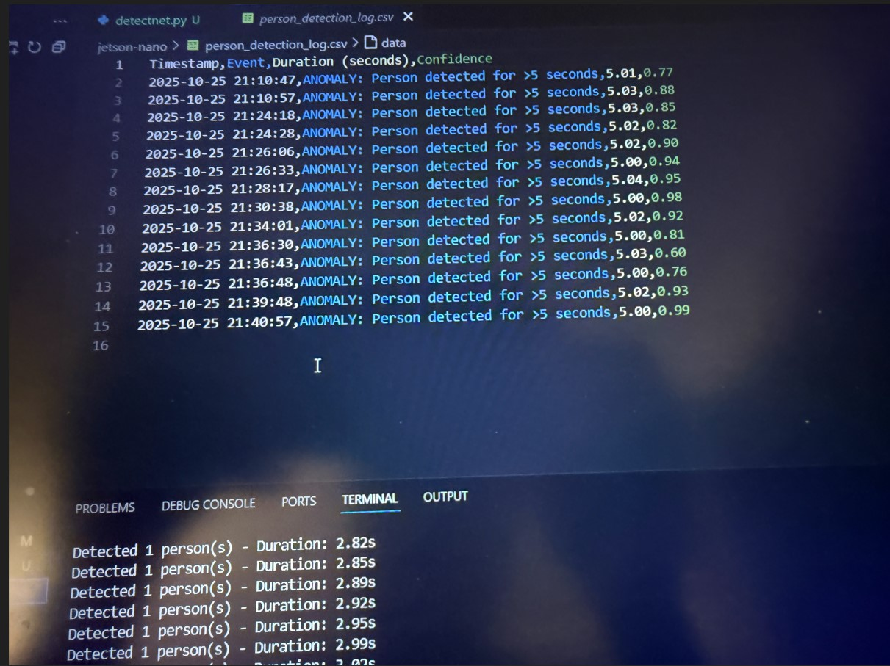

# Anomaly Detection using DetectNet, Jetson-Nano, and USB Camera

## Overview
This project makes use of the detectnet model and deploys it on a jetson-nano device to detect anomalies. Anomalies are detected when there is a person in the frame for more than 5 seconds. 

This project makes use of pretrained models along with OpenCV for frame manipulation.

## Features
- **Real-time Person Detection**: Uses SSD-MobileNet-v2 model for efficient person detection
- **Anomaly Logging**: If a person is detected in the frame for more than 5 seconds, the system triggers an anomaly which is appended to a CSV file for logging along with the detection timestamp
- **Live Statistics Panel**: The system also keeps a nice anomaly stats box inside the video feed to help user keep track of detections
- **Visual Alerts**: Bounding boxes change color (green → red) when anomaly threshold is reached

## How It Works
1. The system continuously monitors the video feed
2. When a person is detected, a timer starts
3. If the person remains in frame for more than 5 seconds, an anomaly is logged
4. The anomaly count and timestamp are displayed in a statistics panel
5. All anomalies are saved to `person_detection_log.csv` with timestamp and confidence scores

## Screenshots

### Normal Detection (Person detected for less than 5 seconds)


### Anomaly Detected (Person detected for more than 5 seconds)


### CSV Logging Output


## Usage

### Setup
You need to clone the jetson-inference repo first:
```bash
git clone https://github.com/dusty-nv/jetson-inference.git
```

You can create a docker container with the command inside this repo as:
```bash
cd jetson-inference
docker/run.sh
```
This will create a docker container and inside of the container you can clone this repo and run the code and you won't have to install any dependencies.

### Running the Detection Script
```bash
python3 detectnet.py <input_source> <output_destination>
```

**Example:**
```bash
python3 detectnet.py /dev/video0
```
where `video0` is for the USB camera

## Technologies Used
- NVIDIA Jetson Nano
- JetPack SDK (jetson-inference, jetson-utils)
- OpenCV
- DetectNet (SSD-MobileNet-v2)
- Python 3

